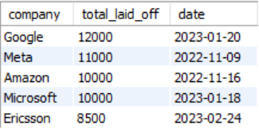

# Data Analysis Using SQL

## Table of Contents
- [Project Overview](#project-overview)
- [Data Source](#data-source)
- [Tools](#tools)
- [Data Cleaning](#data-cleaning)
- [Exploratory Data Analysis](#exploratory-data-analysis)
- [Conclusion](#conclusion)

### Project Overview
This project aims to examine worldwide layoff data to uncover patterns, trends, and key insight. This analysis will help understand the factors influencing layoffs, the industries most affected and geographical trends.

### Data Source
The main data source fro this analysis is the 'layoffs.csv' file, contained detailed information about total number of employees laid off and the corresponding percentages for each company.

### Tools
MySQL Workbench

### Data Cleaning
1. Remove Duplicates
   
   First, we identify duplicates using a window function to create a temporary row numbering system. Once confirmed, we'll create a new table with the *row_num* column for duplicate management.
   

   The rows that having row_num > 1 will be deleted.

2. Standardize Data

- I cleaned up company names by removing unnecessary spaces using TRIM function. 
- I standardized the industry names by combining similar entries. For example, *Crypto*, *Cryptocurrency*, *Crypto Currency* were all changed to just *Crypto* since they mean the same thing.
- I also fixed country names - both *United States* and *United States.* were made consistent as *United States*
- Finally, changed the date column from text format to proper date format so we can easily analyze trends over time.
  
3. Removing Nulls and Blank Values
   
- Implemented a self-join method to automatically populate the missing industry information by referencing properly categorized entries of the same companies.

4. Remove unnecessary column and rows 
- Identified and removed records with NULL values in both *total_laid_off* and *percentage_laid_off* columns. These incomplete entries lacks the essential data and therefore making them unusable for meaningful analysis.
- After successfully removing all duplicate records using the *row_num* column, we restored the original table structure by dropping the temporary helper column.
   
### Exploratory Data Analysis
1. Dataset Date Range Verification
   
   
    This dataset contain layoff information from March 11, 2020 to March 3, 2023. This time period covers important world events like the COVID-19 pandemic that started in 2020 and the economic recovery that followed. Analyzing layoffs during these years helps us understand how various industries and countries responded to these economic challenges.

2. Analysis of 100% Layoffs Events
   

   The data shows that many companies that laid off all their employees were early-stage startups. These were young companies still in their beginning phases and didn't have much money to keep the business running.

3. Top Single-Day Layoff Events by Company
   

4. Companies with Highest Cumulative Layoffs
   

5. Geographic Distribution: Layoffs by Country
   

6.  Annual Layoff Trends by Year (2020 - 2023)
   

7. Total Layoffs Based by Industry
   
   
### Conclusion
After analyzing the global layoff from 2020 to 2023, we found important patterns that show which industries and companies were most affected by job cuts. The main things we learned are:

- Consumer, Retail & Transportation sectors experienced the highest layoffs
- 2022 was the peak year with 160,661 layoffs
- United States dominated with 256,559 layoffs
- Tech giants company led layoffs were Amazon, Google, Meta, and Microsoft
  
The data reveals a post-pandemic economic adjusment, particulary in tech and consumer sectors, with the United States being the epicenter of global workforce reduction during 2022 to 2023.